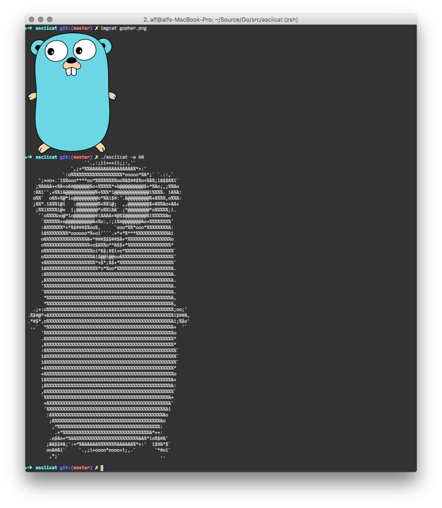

# asciicat
Simple Image to ASCII Art Conversion Tool. Written in Go!

## Install

[Homebrew](http://brew.sh/):
```
brew tap alfg/tap
brew install asciicat
```

Or using Go:
```
go get github.com/alfg/asciicat
```

## Usage
```
asciicat -i gopher.png

-i - Relative path to image file.
-w - Width of output.
```

## Example


## License
MIT

## Credits
Based on example algorithms from:
http://stackoverflow.com/questions/32987103/image-to-ascii-art-conversion
